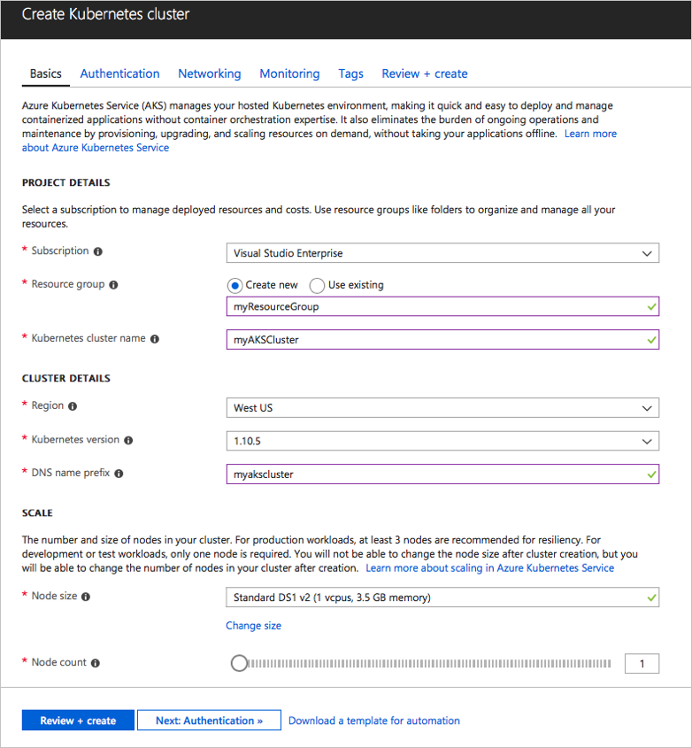

## Create an Azure web app to host a container

1. Sign into Azure at [https://portal.azure.com](https://portal.azure.com).

2. In the Azure Portal, choose **Create a resource**, **New**, **Containers**, then choose **Kubernetes Service**.    

3. Select or create a new Resource Group, enter name for your new Kubernetes cluster and DNS name prefix

   

4. Click on **Review + Create ** and then once validation passes, click on **Create** button.

5. Wait until the new AKS cluster has been created. Then you can create a release pipeline as shown in the next section.

The **Docker** tasks you used in the build pipeline when you created the
build artifacts push the Docker image back into your Azure Container Registry.
The AKS cluster you created here will host an instance of that image and expose it as a website.
