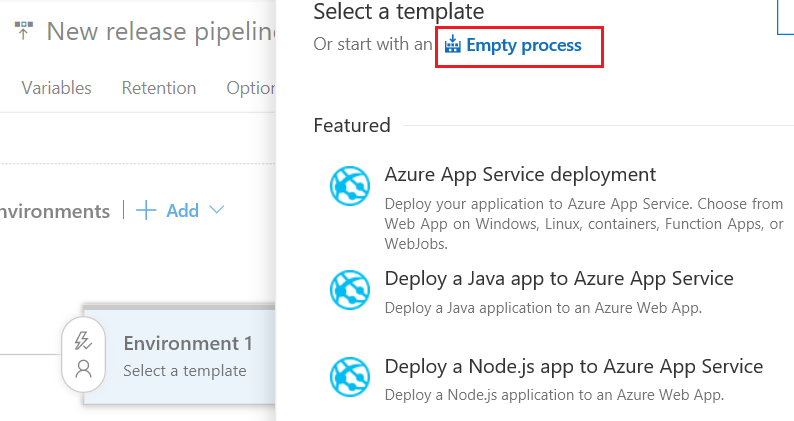

## Create a release pipeline

1. In the **Build &amp; Release** hub, open the build summary for your build.

   

2. In the build summary page, choose the **Release** icon to start a new release pipeline.

   

   If you have previously created a release pipeline that uses these build artifacts, you will
   be prompted to create a new release instead. In that case, go to the **Releases** tab page and
   start a new release pipeline from there by choosing the **+** icon.

3. Select the **Empty Process**.

   

4. Go to **Environment 1** and click on **+** icon to add new task
5. Add **Helm tool installer** task
6. Click on **+** icon again to add new **Package and deploy Helm charts** task
   Configure the properties as follows:
   
   - **Azure Subscription**: Select a connection from the list under **Available Azure Service Connections** or create a more restricted permissions connection to your Azure subscription.
     If you are using VSTS and if you see an **Authorize** button next to the input, click on it to authorize VSTS to connect to your Azure subscription. If you are using TFS or if you do not see
     the desired Azure subscription in the list of subscriptions, see [Azure Resource Manager service connection](../../library/connect-to-azure.md) to manually set up the connection.

   - **Resource Group**: Enter or select the resource group of your **AKS cluster**.  
   
   - **Kubernetes cluster**: Enter or select the **AKS cluster** you have created.  
   
   - **Command**: Select **init** as Helm command.
   
7. Again click on **+** icon to add another **Package and deploy Helm charts** task
   Configure the properties as follows:
   
   - **Azure Subscription**: Select a connection from the list under **Available Azure Service Connections** or create a more restricted permissions connection to your Azure subscription.
     If you are using VSTS and if you see an **Authorize** button next to the input, click on it to authorize VSTS to connect to your Azure subscription. If you are using TFS or if you do not see
     the desired Azure subscription in the list of subscriptions, see [Azure Resource Manager service connection](../../library/connect-to-azure.md) to manually set up the connection.

   - **Resource Group**: Enter or select the resource group of your **AKS cluster**.  
   
   - **Kubernetes cluster**: Enter or select the **AKS cluster** you have created.  
   
   - **Namespace**: Enter your Kubernetes cluster namespace where you want to deploy. If you don't have one, enter **dev**.

   - **Command**: Select **upgrade** as Helm command.

   When you select the **upgrade** as helm command, the task recognizes it and shows some additional fields.

   - **Chart Type**: Select **File Path** as Chart type.

   - **Chart Path**: Enter the path to your Helm chart. If you are publishing it using CI build, you can pick the file package by clicking on file picker.
   Or simply enter $(System.DefaultWorkingDirectory)/**/*.tgz

   - **Release Name**: Give any name to your release. For example **azuredevops**
   
   - **Arguments**: Enter the arguments and their value here. If you are using sample application for this document
   
    ```
    --set image.repository=$(imageRepoName) --set image.tag=$(Build.BuildId) 
    --set ingress.enabled=true --set ingress.hostname=$(hostName)

    ```
   > Either set the values of $(imageRepoName) in the variable section or replace it with your image repository name, which is typically of format `name.azurecr.io/coderepository`
   > You can find $(hotname) values in the Azure portal in the **Overview** and **Repositories** tabs for your AKS Cluster.

8. Save the release pipeline.

## Create a release to deploy your app

You're now ready to create a release, which means to start the process of running the release pipeline with the artifacts produced by a specific build. This will result in deploying the build:

1. Choose **+ Release** and select **Create Release**.

2. In the **Create new release** panel, check that the artifact version you want to use is selected and choose **Create**.

3. Choose the release link in the information bar message. For example: "Release **Release-1** has been created".

4. Open the **Logs** tab to watch the release console output.

5. After the release is complete, navigate to your site running in Azure using the Web App URL `http://{web_app_name}.azurewebsites.net`, and verify its contents.
